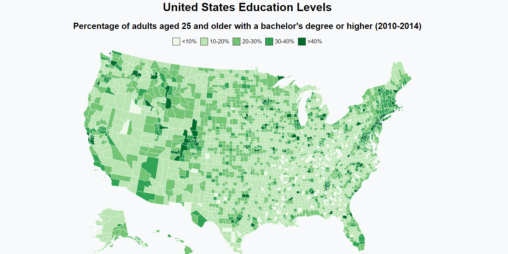

# Visualize-data-with-a-choropleth-map

## Project Description

This project is a choropleth map that visualizes the percentage of adults aged 25 and older with a bachelor's degree or higher in various counties across the United States based on data from 2010 to 2014. The application is built using HTML, CSS, and JavaScript, leveraging the D3.js library for creating the map and visualizing the data.

## Project Setup

To set up the project locally, follow these steps:

1. Clone the repository to your local machine using:
   ```bash
   git clone https://github.com/your-username/visualize-data-with-a-choropleth-map

[the live site](https://moezltifi.github.io/visualize-data-with-a-choropleth-map/)

